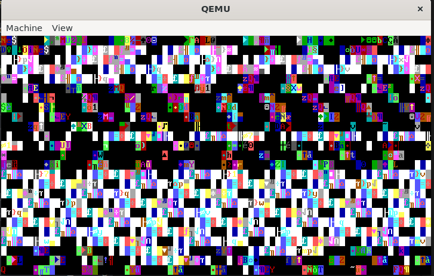

# sOS (Shitty Operating System)

I have always wanted to learn all about operating systems. Something about them facinates me. So what better to learn about one, to code one from scratch, using two languages I have never used, and one that I know most about, NASM (assembly), C, and C# (maybe). This is the first time I have touched ASM and C and this will be a long journey, but I will test me so Im taking up the challenge.

I am using NASM via WSL on Ubuntu Latest for the assembly
I am using gcc as the C compiler
And using dotnet-8.0 for the C#

If you would like to join me in this journey, please feel free.

# Journey Updates!

## Update 1: 
I managed to find a tutorial for a bootloader.asm that prints hello world to the screen, and it works!

## Update 2: 
I have tried to add a kernel with a vga driver that I found which is going well (not). With some AI magic and hours wasted hopefully it should be fixed soon! I have found this website and I'm working around it https://dev.to/frosnerd/writing-my-own-boot-loader-3mld.


## Update 3: 
After somewhat following that guide and rebuilding my bootloader, It's all going well! I really recommend that website because it tells you all about what the file does! Next, back to the VGA Driver!

## Update 4: 
After around 3-4 days of debugging, i finally decided to go on GitHub source code for that article and borrow indefinitely the bootloader code. And it all finally works. The VGA driver in finished and works fine. `print_string()` finally allows this `print_string("Hello, World")` instead of just this, 
```c
char string[] = "Hello, World!";
print_string(string);
```
And the keyboard driver works now too! Horray!

## Update 5:
I have now finished the Shell aspect of my operating system. You can use the HELP command to see the available commands.
It's now time to move to the last part of the tutorial before I am on my own. Dynamic Memory Management.

## Update 6:
I have chosen to start working on the Filesystem for sOS over the DMM. I plan to be using a EXT2 filesystem structure. This is now being developed as you read. Everything has been going fine so far, with a few hiccups.
